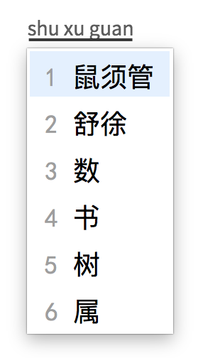

# 闲耘的 Rime 配置说明



[Rime](https://github.com/rime) 输入法是一款适用于 Mac OSX, Linux,
Windows 的输入法，Rime 在不同平台下的对应名称如下：

* Mac OSX: 鼠鬚管 ([Squirrel](https://github.com/rime/squirrel))
    配置目录：`~/Library/Rime/`
* Linux: 中州韻 (ibus-rime)
    配置目录：`~/.config/ibus/rime/`
* Windows: 小狼毫 (Weasel)
    配置目录：`%APPDATA%\Rime`

Rime 的配置文件不同平台的放置在不同的目录，
在配置目录中，主要使用 `yaml` 进行配置。
目录中自有的配置文件不建议直接修改，因为可能会被自动复写。
用户配置一般以原始配置文件名增加 .custom 二级后缀的方式，
例如：Mac OSX 下的原始配置 `squirrel.yaml`，对应的用户配置就是
`squirrel.custom.yaml` 文件。

修改 `.custom` 配置后，『重新部署』Rime 输入法会将用户的配置增加或更新到
对应的原始配置中。

## 安裝

```
$ git clone git@github.com:hotoo/rime.git
$ cd rime
$ make install
```

## 卸載

```
$ cd rime
$ make uninstall
```

## 同步

installation.yaml

```yaml
installation_id: "hotoo.rmbp"
sync_dir: "/Users/hotoo/Dropbox/RimeSync"
```


## 参考
* [Rime 定製指南](http://code.google.com/p/rimeime/wiki/CustomizationGuide)
* [中州韵（小狼毫，鼠须管）输入法设置](http://blog.yesmryang.net/rime-setting/)
* [說明書#同步用戶資料](https://code.google.com/p/rimeime/wiki/UserGuide#同步用戶資料)
* [Author: 佛振 (lotem)@github](https://github.com/lotem)
* [如何从 QIM 迁移至 Squirrel（鼠鬚管）](http://cocoabob.net/?p=919)
